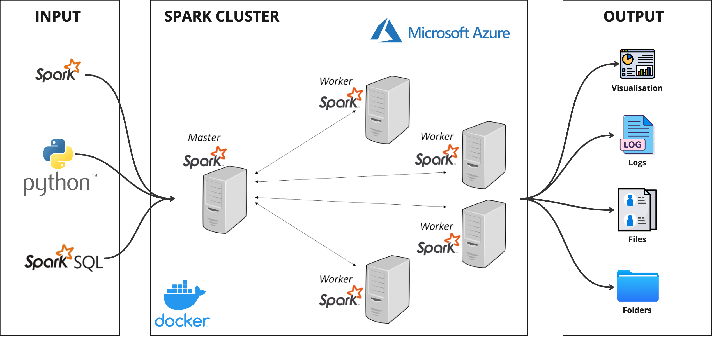

# Japan Visa Analysis on Azure Spark

This project builds an end-to-end data pipeline for Japan visa data using PySpark and Plotly, running on a Spark master-worker cluster inside Docker on Azure.

The pipeline:
- Ingests raw CSV data
- Cleans and standardizes country names
- Enriches records with continent information
- Generates interactive visualizations
- Exports cleaned data and charts as HTML/CSV outputs

## Table of Contents
- [Project Overview](#project-overview)
- [Architecture](#architecture)
- [Project Structure](#project-structure)
- [Requirements](#requirements)
- [Quick Start](#quick-start)
- [Run the Pipeline](#run-the-pipeline)
- [Outputs](#outputs)
- [Dashboard](#dashboard)
- [Azure File Transfer Helpers](#azure-file-transfer-helpers)
- [Troubleshooting](#troubleshooting)

## Project Overview
This repository contains:
- Spark ETL job: clean and enrich visa data
- Spark visualization job: generate three Plotly visualizations
- Dockerized Spark cluster (1 master + 4 workers)
- A simple HTML dashboard to view generated charts

## Architecture

- Spark master and worker nodes run via Docker Compose
- Input data is mounted into containers from `src/input`
- Jobs are mounted from `src/jobs`
- Outputs are written to `src/output`

Container services are defined in:
- `src/docker-compose.yml`

Spark image and dependencies are defined in:
- `src/Dockerfile.spark`
- `src/requirements.txt`

## Project Structure

```text
spark_on_cloud/
├── dashboard.html
├── download_files.sh
├── upload_files.sh
├── src/
│   ├── docker-compose.yml
│   ├── Dockerfile.spark
│   ├── requirements.txt
│   ├── input/
│   │   └── visa_number_in_japan.csv
│   ├── jobs/
│   │   ├── transformation_job.py
│   │   └── visualisation.py
│   └── output/
│       ├── visa_number_in_japan_cleaned.csv/
│       ├── visa_number_in_japan_continent_2006_2017.html
│       ├── visa_number_in_japan_by_country_2017.html
│       └── visa_number_in_japan_year_map.html
└── spark-cluster_key.pem
```

## Requirements
- Azure VM (or any Linux host) with Docker and Docker Compose installed
- Python 3.x (optional for local scripting)
- SSH key configured for SCP transfer (`spark-cluster_key.pem`)

Python packages used in the Spark image:
- pyspark
- plotly
- pycountry
- pycountry_convert
- fuzzywuzzy
- pandas
- numpy
- and related dependencies from `src/requirements.txt`

## Quick Start

1. Place the input file in:
- `src/input/visa_number_in_japan.csv`

2. Build and start the Spark cluster:

```bash
cd src
docker compose up -d --build
```

3. Verify containers:

```bash
docker compose ps
```

4. Open Spark Master UI:
- `http://localhost:9090`

## Run the Pipeline
Run both jobs inside the Spark master container.

1. Run ETL (cleaning + enrichment):

```bash
docker compose exec spark-master /opt/spark/bin/spark-submit /opt/spark/jobs/transformation_job.py
```

2. Run visualizations:

```bash
docker compose exec spark-master /opt/spark/bin/spark-submit /opt/spark/jobs/visualisation.py
```

## Outputs
After execution, generated files are available in `src/output`:

- Cleaned dataset:
  - `visa_number_in_japan_cleaned.csv/`

- Interactive charts:
  - `visa_number_in_japan_continent_2006_2017.html`
  - `visa_number_in_japan_by_country_2017.html`
  - `visa_number_in_japan_year_map.html`

## Dashboard
To view all visualizations in one page, open:
- `dashboard.html`

The dashboard embeds the generated chart HTML files from `src/output`.

## Azure File Transfer Helpers
You can use the included helper scripts to upload code to Azure and download generated outputs.

- Upload local `src` folder to Azure home directory:

```bash
bash upload_files.sh
```

Current command inside script:

```bash
scp -i spark-cluster_key.pem -r ./src/* azureuser@48.220.48.95:/home/azureuser
```

- Download output folder from Azure to local `src`:

```bash
bash download_files.sh
```

Current command inside script:

```bash
scp -i spark-cluster_key.pem -rp azureuser@48.220.48.95:/home/azureuser/output src/
```

## Troubleshooting
- If Spark jobs fail due to missing packages, rebuild image:

```bash
cd src
docker compose build --no-cache
docker compose up -d
```

- If charts look outdated, re-run both jobs to regenerate output HTML files.
- If dashboard cannot find charts, confirm output files exist in `src/output` and file names match exactly.

## Notes
- Country standardization uses fuzzy matching and manual corrections in `transformation_job.py`.
- Continent mapping is performed with `pycountry` and `pycountry_convert`.
- Visualization logic is implemented in `visualisation.py` using Plotly Express.
